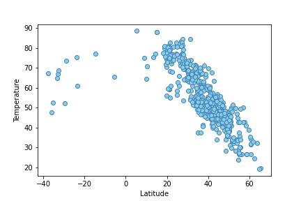
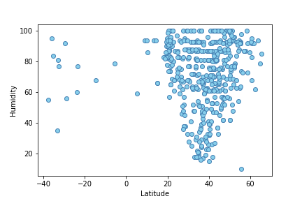
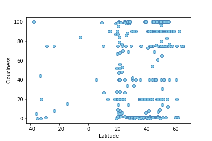
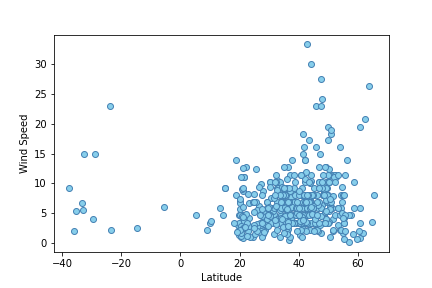

### Use a Python library and the OpenWeatherMap API to collect weather data
* 
* Create scatterplots of weather data from world cities

        Latitude vs Temperature
    

        Latitude vs Humidity
     

        Latitude vs Cloudiness
     

        Latitude vs Wind Speed
     
